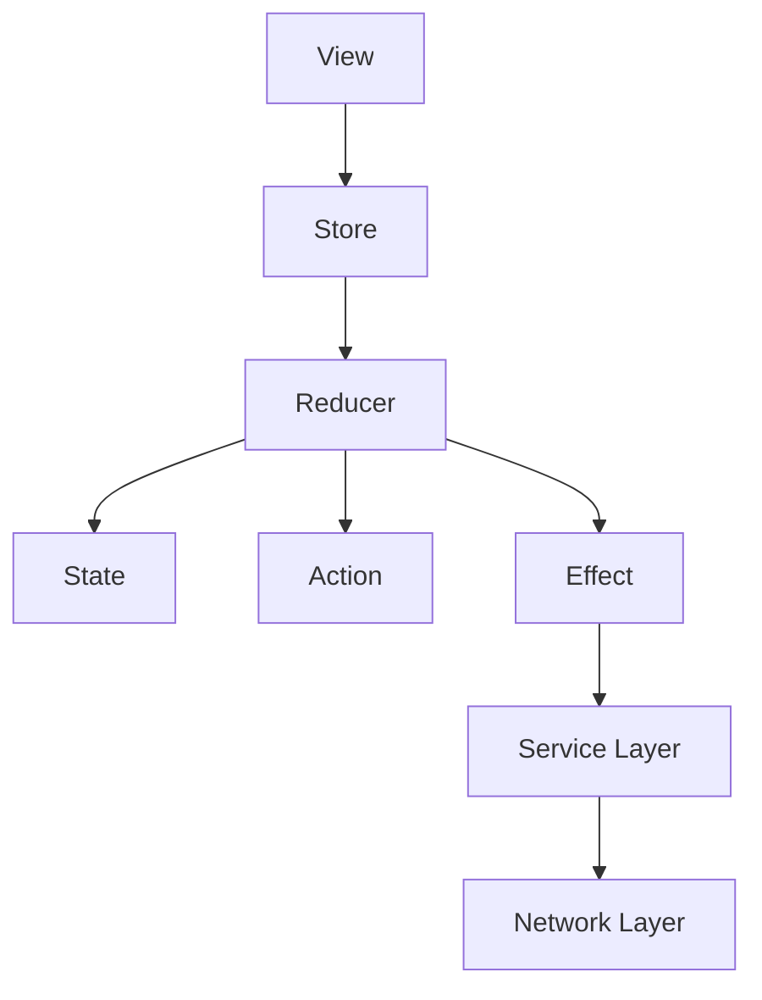
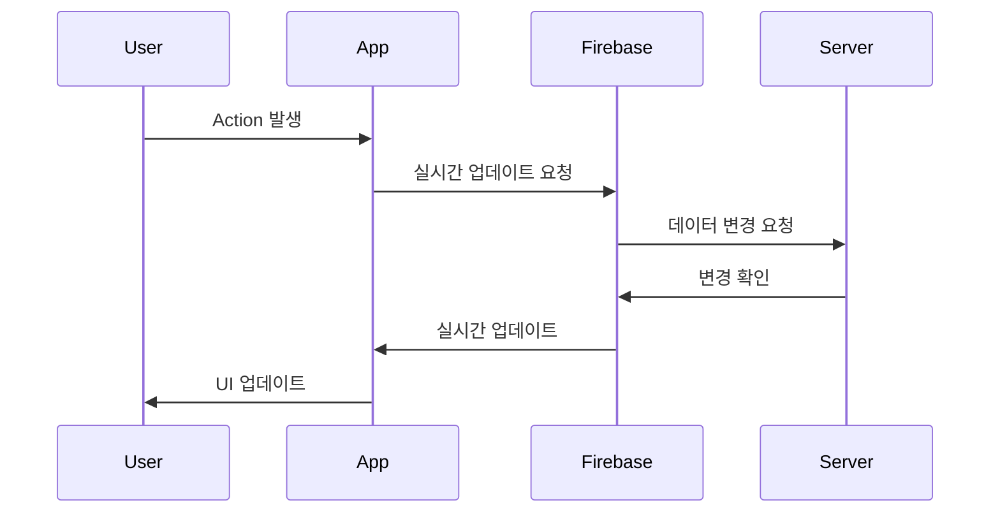
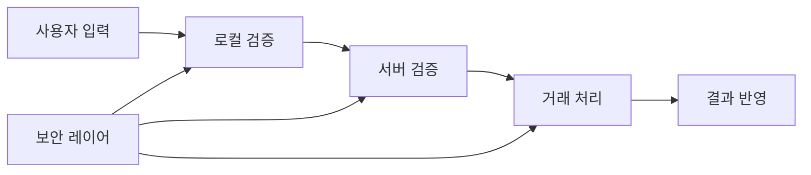
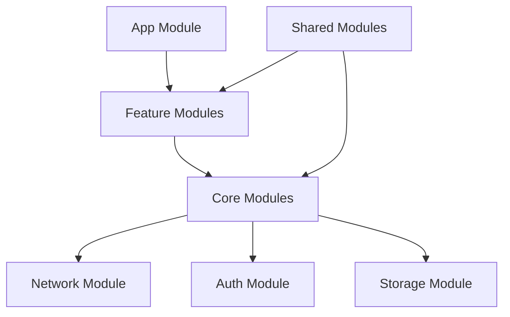
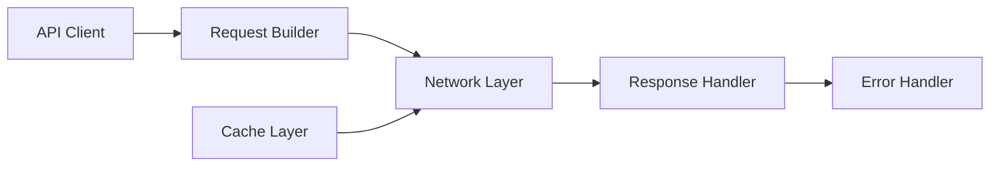

# HaetsalMauel iOS

지역 기반 봉사 활동 매칭 플랫폼 iOS 앱

## 🛠 기술 스택

### 아키텍처

- The Composable Architecture (TCA)
- Tuist를 활용한 모듈화
- MVVM 패턴

### 주요 라이브러리

- Combine
- Firebase Firestore
- SwiftUI
- Moya (네트워크)

## 💡 주요 기능 및 기술적 도전 과제

### 1. 결제 시스템

- **안전한 비밀번호 관리**

  - 4자리 PIN 기반 비밀번호 시스템
  - 비밀번호 변경 및 검증 로직
  - 실시간 잔액 업데이트

- **실시간 거래 처리**
  - Combine을 활용한 비동기 거래 처리
  - 거래 내역 실시간 동기화
  - 에러 처리 및 롤백 메커니즘

### 2. 마켓플레이스 시스템

- **게시글 관리**

  - 카테고리 기반 게시글 필터링
  - 실시간 상태 업데이트
  - 이미지 업로드 및 관리

- **신청/지원 관리**
  - 실시간 지원자 목록 업데이트
  - 상태 변경 알림
  - 지원자 필터링

### 3. 실시간 채팅 시스템

- **Firebase Firestore 활용**
  - 실시간 메시지 동기화
  - 채팅방 관리
  - 메시지 상태 추적

### 4. 인증 시스템

- **소셜 로그인**
  - 카카오 로그인
  - 애플 로그인
  - 토큰 기반 인증

### 5. 지역 기반 서비스

- **계층적 지역 데이터**
  - 시/구/동 3단계 지역 구조
  - 동적 지역 데이터 로딩
  - 지역 기반 필터링

## 🔧 기술적 구현 상세

### 1. TCA 기반 상태 관리



**구현 상세**:

- **상태 관리 최적화**
  - `@Dependency` 프로퍼티 래퍼를 활용한 의존성 주입
  - `Reducer` 프로토콜을 통한 상태 변경 로직 캡슐화
  - `Effect`를 통한 비동기 작업 처리

**트러블슈팅**:

- **문제**: Reducer 간 상태 공유 시 순환 참조 발생
- **해결**:
  - `Scope`를 활용한 하위 Reducer 분리
  - `ifLet`을 통한 선택적 상태 관리
  - `CasePath`를 활용한 타입 안전한 상태 접근

### 2. 실시간 데이터 동기화



**구현 상세**:

- **Firebase Firestore 최적화**
  - 실시간 리스너 최소화를 위한 쿼리 최적화
  - 오프라인 지원을 위한 캐싱 전략
  - 배치 처리로 네트워크 요청 최소화

**트러블슈팅**:

- **문제**: 실시간 업데이트로 인한 UI 깜빡임
- **해결**:
  - Diffable DataSource 활용
  - 애니메이션 최적화
  - 상태 업데이트 배치 처리

### 3. 결제 시스템 보안



**구현 상세**:

- **보안 계층 구현**
  - 키체인을 활용한 민감 정보 저장
  - JWT 토큰 기반 인증
  - 거래 서명 검증

**트러블슈팅**:

- **문제**: 동시 거래 처리 시 레이스 컨디션
- **해결**:
  - Combine의 `share()` 연산자 활용
  - 거래 큐 시스템 구현
  - 낙관적 UI 업데이트

### 4. 모듈화 아키텍처



**구현 상세**:

- **Tuist 모듈화 전략**
  - Feature 단위 모듈 분리
  - 공통 모듈 추출
  - 의존성 주입 시스템

**트러블슈팅**:

- **문제**: 모듈 간 순환 참조
- **해결**:
  - 인터페이스 모듈 분리
  - 의존성 방향 단방향화
  - 프로토콜 기반 결합도 감소

### 5. 네트워크 레이어



**구현 상세**:

- **Moya 기반 네트워크 구현**
  - 플러그인 시스템 활용
  - 응답 캐싱 전략
  - 에러 처리 체인

**트러블슈팅**:

- **문제**: 네트워크 요청 실패 시 재시도 로직
- **해결**:
  - Combine의 `retry` 연산자 활용
  - 지수 백오프 전략 구현
  - 오프라인 모드 지원

## 🏗 프로젝트 구조

```
Projects/
├── App/                 # 메인 앱 모듈
├── UISystem/           # UI 컴포넌트
├── EumNetwork/         # 네트워크 레이어
├── DesignSystemFoundation/ # 디자인 시스템
└── EumAuth/            # 인증 모듈
```

## 🔄 개발 프로세스

1. 요구사항 분석
2. 아키텍처 설계
3. 모듈별 개발
4. 통합 테스트
5. 배포

## 🚀 향후 개선 사항

- 성능 최적화
- 테스트 커버리지 향상
- 새로운 기능 추가
- 사용자 경험 개선
